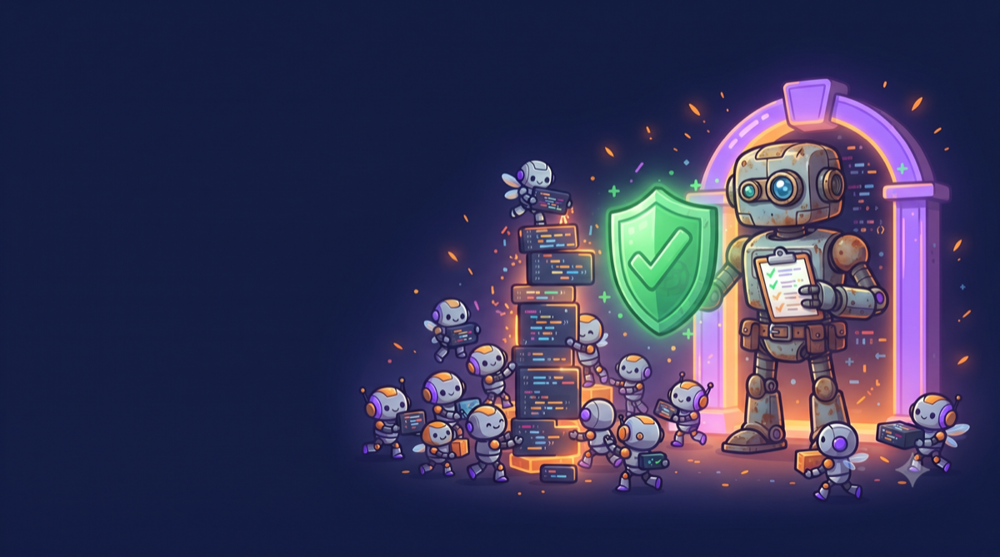
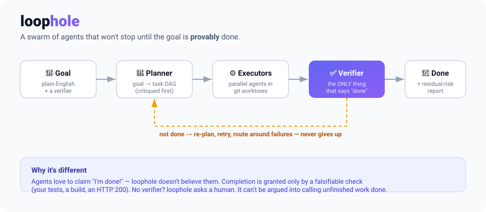

<div align="center">



# loophole

**A swarm of AI agents that work on a goal until it's _provably_ done — and tells you exactly what it couldn't prove.**

**The acceptance layer for autonomous coding — "CI for AI agents." Bring your own agent; loophole is the trusted gate that decides what's _actually_ done.**

[](https://github.com/Chuzom/loophole/actions/workflows/ci.yml)
[](https://pypi.org/project/loophole-agents/)
[](tests/)
[](.github/workflows/sandbox.yml)
[](gauntlet/README.md)
[](#)
[](#)
[](#anti-reward-hacking-the-part-most-tools-skip)
[](LICENSE)

*New here? [What loophole actually is](blog/what-loophole-is.md) — no jargon, 2 minutes.*

</div>

---

<details>
<summary><b>Contents</b></summary>

- [See it work in 10 seconds](#️-see-it-work-in-10-seconds--no-setup-no-api-key)
- [The problem](#the-problem) · [The idea](#the-idea)
- [60-second quickstart](#60-second-quickstart)
- [How it works](#how-it-works) · [Three kinds of "done"](#three-kinds-of-done)
- [Anti-reward-hacking](#anti-reward-hacking-the-part-most-tools-skip)
- [CLI](#cli) · [Providers](#providers)
- [Bring your own executor](#bring-your-own-executor)
- [For teams — CI acceptance gate](#for-teams--loophole-as-a-ci-acceptance-gate) · [vs. AI review bots](#not-another-ai-review-bot)
- [Honest status & safety](#honest-status--safety) · [Roadmap](#roadmap)
- [Contributing](#contributing) · [License](#license)

</details>

---

## ▶️ See it work in 10 seconds — no setup, no API key

<div align="center">

</div>

Both demos are fully self-contained — **no LLM, no keys, no config:**

```bash
loophole demo          # the 30-sec proof above — a check rejects a fake "Done", then accepts the fix.
loophole watch --demo  # watch the swarm work LIVE in your terminal (animated, no browser).
```

`loophole demo` reaching **DONE** *only after the bug is fixed* is the whole idea in one command: **a check decides "done," never the agent.**

---

## The problem

You give an AI agent a real task — *"build a REST API for a todo app, with tests"* — and three things go wrong:

1. **It quits too early.** One pass, a confident *"Done! ✅"*, and a half-working result.
2. **It lies about being finished.** Models are trained to please. *"All tests pass!"* — except it deleted the failing tests.
3. **It can't tell when it's actually done.** No goalpost, so it either stops at the first plausible output or loops forever.

`/loop`-style tools keep one agent grinding. But a single agent in a single context can't divide labor, can't hold a big task, and still grades its own homework.

## The idea

**loophole** turns a goal into a **task graph**, runs a **swarm of agents** across it in isolated git worktrees, and refuses to stop until an **external, falsifiable check** says the goal is met.

> The key move: **agents never decide they're done. A check does.**
>
> Your tests passing. A build succeeding. `curl` returning 200. If a goal can't be checked, loophole **asks a human** instead of guessing. It cannot be argued into calling unfinished work complete.

When the check fails, loophole re-plans, retries, and routes around dead ends — **until it genuinely passes or hits your budget.** Then it hands you a **Residual-Risk Report**: what it proved, and what it didn't.

*(Why build this at all? [The bugs that convinced me](blog/why-loophole-exists.md) — including a few loophole caught in itself.)*

## 60-second quickstart

```bash
pip install loophole-agents   # zero-config: works with local Ollama out of the box

# point it at a goal + a way to check "done":
loophole run "Create add.py with add(a,b) returning a+b" \
  --verify 'python3 -c "from add import add; assert add(2,3)==5; print(\"ok\")"' \
  --workspace ./out
```

Working from a clone instead (contributing, or want an editable install)? See
[CONTRIBUTING.md](CONTRIBUTING.md#dev-setup) — `pip install -e '.[dev]'` in place
of the line above.

```text
🎯 goal goal-3034039ba5f5
• round 1: planning
• round 1: executing 1 task(s)
• round 1: verify -> PASS (score 1000)
• goal -> done (all verifiers passed)

================ Residual-Risk Report ================
Outcome: DONE
What was VERIFIED:  [PASS] hard:python3 -c "from add import add; ..."
What was NOT proven: anything outside the verifier's scope.
=====================================================

── LoopHole scorecard ─────────────────────────
  ✓ VERIFIED DONE   (1 round · 3s)
  1 agent merge accepted by the verifier
  0 candidates the verifier REJECTED before accepting
  0 cheats the boundary blocked
```

That's the whole contract: **you define "done," loophole reaches it** — and every run ends
with a **scorecard** (`loophole stats` aggregates them) so you can *see*, in numbers, that
"done" was verifier-backed.

## How it works

<div align="center">

</div>

```
🎯 Goal ─▶ 🧭 Planner ─▶ ⚙️ Executors ─▶ ✅ Verifier ─▶ 🏁 Done
              ▲              (worktrees)        │
              └──── not done: re-plan / retry ──┘
```

| Stage | What happens |
|---|---|
| **Goal Contract** | Your goal + verifier(s). A goal with no way to check "done" is **rejected up front**. |
| **Planner** | Decomposes the goal into a dependency DAG; a critic pass attacks the plan before any work runs. |
| **Executors** | Tool-using agents (write/read files, run shell) work **in parallel**, each in its own git worktree, then merge serially. |
| **Verifier** | Runs your falsifiable check from a **fresh checkout** of the merged result. Only this grants completion. |
| **Loop control** | Measures progress by verifier metrics (not vibes), detects when it's stuck, and re-plans — with budget + round circuit-breakers. |

## Three kinds of "done"

| Verifier | Behavior | Use it for |
|---|---|---|
| **`hard`** — a command | exit 0 = done. The gold standard. | `pytest -q`, `npm test`, `make`, a health-check `curl` |
| **`soft`** — an LLM rubric | can only **veto**, never grant | subjective quality gates layered on top of a hard check |
| **`human`** — a checkpoint | loophole pauses and asks you | irreducibly subjective goals (prose, design) |

## Anti-reward-hacking (the part most tools skip)

Because the verifier *is* the goalpost, loophole defends it:

- **Verifier adversary review** — before any work runs, an LLM pass attacks your declared verifier (*"how could an agent pass this without satisfying intent?"*) and lists the concrete bypass strategies it finds in the Residual-Risk Report, so you can harden the check first.
- **Verification boundary** — protected files (your tests, configs) are checked against the original commit; if an agent edits them, the run **fails**.
- **Test-count audit** — the suite can't silently shrink to make red turn green.
- **No fake "done"** — if an agent claims completion but changed nothing, it's rejected.
- **Secrets never reach verifiers** — your `ANTHROPIC_API_KEY` and friends are scrubbed from the subprocess environment.
- **Scoped egress** — an executor granted network access reaches *only* the hosts you declare (macOS: enforced via a localhost-only jail + a host-allowlisted proxy; denied hosts are 403'd and audited).

Don't take that list on faith — **[run the reward-hacking gauntlet](gauntlet/README.md)**
yourself: five real cheats (including the exact test-config-editing pattern a
[2026 Cursor study](https://www.marktechpost.com/2026/06/26/cursor-study-finds-reward-hacking-inflates-coding-agent-benchmark-scores-on-swe-bench-pro/)
found in 57% of audited agent trajectories), each run against the real CLI and
caught. `python -m gauntlet` after installing, or read the
[live results in CI](https://github.com/Chuzom/loophole/actions/workflows/sandbox.yml).

## CLI

```bash
loophole init                                   # infer a starter loophole.json from the repo
loophole init --template refactor-frozen-tests  # or scaffold from a template
loophole init --from-ci                         # infer the verifier from your OWN CI workflow (ground truth), not a file guess
loophole run                                    # auto-loads ./loophole.json
loophole run "<goal>" --verify "pytest -q" [--workspace DIR]
loophole run --contract loophole.json --executor-command 'claude -p {task}'  # BYO agent
loophole run "<goal>" --protect "tests/**" --expect-test-delta 0   # lock the suite
loophole run "<goal>" --verify "pytest -q" --verify-http http://localhost:8000/health   # tests AND a live health check — composable, both must pass
loophole init --template http-service           # starter contract for that pattern
loophole run "<goal>" --verify-coverage 80 --verify-coverage-target mypkg   # hard-fail unless pytest-cov reports >= 80% coverage of mypkg
loophole run --list-rubrics                     # bundled LLM-judge rubrics (no-stub-implementations, no-hardcoded-secrets, ...)
loophole run "<goal>" --verify "pytest -q" --verify-rubric no-stub-implementations   # tests pass AND a judge vetoes placeholder code
loophole init --template rubric-guarded         # starter contract composing a hard verifier with rubric vetoes
loophole contract validate loophole.json        # validate / show a contract (path or URL)
loophole registry list                            # named, shareable acceptance specs
loophole registry add team-default ./loophole.json   # publish a spec; reuse by name
loophole run --contract team-default              # run a registry spec by name
loophole registry add-source https://example.com/team-index.json   # cross-team sharing: point at anyone's hosted index today (no loophole-run hosting required)
loophole run "<goal>"                            # live STREAM view by DEFAULT (append-only)
loophole run "<goal>" --view forge               # THE FORGE full-screen dashboard (TTY only)
loophole run "<goal>" --no-watch                 # plain log (CI / when piping)
loophole run "<goal>" --json --json-file out.json   # machine-readable result (CI/tooling)
loophole run --contract loophole.json --comment      # sticky PR comment + Check Run (needs GITHUB_TOKEN, in a pull_request job)
# models route via Chuzom by DEFAULT (planner=chuzom:simple, executor=chuzom:complex);
# set CHUZOM_URL to route through a live `chuzom-route` server, else local tier policy.
loophole run "<goal>" --executor-model ollama:qwen3-coder:30b   # or pin a model directly
loophole stats                                    # your value scorecard — verified, rejections, cheats blocked
loophole watch --demo                             # self-driving terminal swarm demo (no LLM)
loophole serve                                    # live web FLEET — all runs, click to drill in
loophole serve <goal-id>                          # live web Forge for one run
loophole demo                                     # the 30s 'can't-fake-done' demo (no LLM)
loophole audit <goal-id>                         # full audit trail (the trust artifact)
loophole runs                                    # list past runs
loophole estimate "<goal>" --max-rounds 10     # dry-run cost prediction
loophole status <goal-id>  ·  loophole resume <goal-id>  ·  loophole ls
```

### Exit codes (the CI contract)

`loophole run` and `loophole resume` exit with one of three stable codes — safe to
branch on in a pipeline:

| Code | Meaning | The run… |
|---|---|---|
| `0` | **verified done** — the declared contract passed | executed |
| `1` | **not done** — paused, failed, or budget exhausted | executed |
| `2` | **usage/config error** — bad contract, no goal, unknown provider spec, unknown goal id | never started |

The distinction matters for CI: `1` means the agent tried and the verifier caught
something (working as intended); `2` means the pipeline itself is misconfigured.

## Providers

Provider-agnostic — pick per role (cheap executors, strong planner):

```bash
--planner-model anthropic:claude-sonnet-4-6 --executor-model ollama:qwen3-coder:30b
```

Default is **Ollama** (free, local, zero-config). Set `ANTHROPIC_API_KEY` / `OPENAI_API_KEY` to use those. `pip install -e '.[anthropic]'` or `'.[openai]'` for the SDKs.

## Bring your own executor

loophole's value is the **trusted boundary around an _untrusted_ executor** — so the
executor is a pluggable backend. Use the built-in agent, or drive any external/
frontier coding agent as a black box; git-worktree isolation, the write-allowlist,
merge gate, and verifier apply to every executor — no adapter can grant "done":

```bash
loophole run --contract loophole.json --executor-command 'claude -p {task}'
```

That's the bet: as models commoditize, *who wrote the code* matters less than
*whether it provably passes*. loophole is the neutral referee, not another coder.

### Swarm on top of any agent framework

Each swarm worker can be a **full agent framework** — Claude Code, Codex CLI, aider,
your own — running in its own git worktree while loophole stays the orchestrator +
trust layer. Three are built in:

```bash
loophole run "<goal>" --executor claude-code   # runs `claude -p` per task, streams its
                                               # tool calls into the FORGE (agent_step)
loophole run "<goal>" --executor codex         # runs `codex exec` per task, streams too
loophole run "<goal>" --executor aider         # runs `aider --message` per task
```

#### Compatibility matrix

| Executor | Streams steps into the live view | Network (default) | Sandboxed by default | Status |
|---|---|---|---|---|
| `claude-code` | ✅ (stream-json → `agent_step`) | `api.anthropic.com` | ❌ trusted (subscription keychain auth) | Verified |
| `codex` | ✅ (JSONL `item.completed` → `agent_step`) | `api.openai.com`, `chatgpt.com`, `auth.openai.com` | ❌ trusted (ChatGPT-subscription credentials under `~/.codex/`) | Verified live against codex-cli 0.80.0 |
| `aider` | ❌ (plain text/markdown output, no event stream) | `api.openai.com` | ✅ sandboxed (no credential store to protect) | Flags verified against the real binary (0.82.3); no live LLM run possible in this environment |

`claude-code`/`codex` default **trusted** (unsandboxed) because both need to read a
stored subscription credential outside the worktree — the same trade-off, made for
the same reason. `aider` needs only an API key passed through `--executor-secret`, so
it stays fully OS-sandboxed with no downside. Every executor, trusted or not, still
sits behind the write-allowlist, merge gate, and verifier — **no adapter can grant
"done."**

**Deliberately out of scope for now:** Devin (API/web-first product, no public
headless CLI to verify against) and Cursor/Composer (IDE-integrated, no stable public
headless invocation). OpenHands was investigated and skipped too — it has no simple,
verifiable pip-installable CLI (`pip install openhands` resolves to an unrelated
placeholder package). All three remain usable today via the generic
`--executor-command` escape hatch once you have them installed by whatever means
their project documents.

> **Trust exception:** the built-in `claude-code` adapter defaults to **trusted** — it
> runs *outside* the OS sandbox so it can reach your subscription login (macOS
> keychain). What still holds regardless: git-worktree isolation, the write-allowlist,
> merge gate, and verifier — **no adapter, trusted or not, can grant "done."** Force it
> back into the sandbox with `--executor-sandboxed` (this blocks keychain/subscription
> auth; API-key auth via `--executor-secret` keeps working sandboxed). Generic
> `--executor-command` executors are always fully OS-sandboxed by default.

For an API-calling framework, grant scoped egress without touching the filesystem
sandbox — on macOS `--executor-network` is **enforced**: the jail's network is
localhost-only and traffic tunnels through a host-allowlisted egress proxy (denied
hosts are 403'd and land in the audit trail). On Linux/bubblewrap egress is still
all-or-nothing (netns scoping is on the roadmap):

```bash
loophole run "<goal>" --executor claude-code \
  --executor-network api.anthropic.com --executor-secret ANTHROPIC_API_KEY
```

**Add your own framework** — implement a tiny `Executor` subclass, register it under
the `loophole.executors` entry point, and `loophole run --executor <name>` picks it up
(it appears in `loophole executor list`). The sandbox → write-allowlist → merge gate →
verifier boundary is unchanged; no adapter can grant "done." Copy-paste template:
**[`examples/adapter_package/`](examples/adapter_package/)**.

## For teams — loophole as a CI acceptance gate

Let any agent open a PR; make loophole the gate that decides if it's done — in CI,
on neutral ground, with a reviewable audit trail:

### Not another AI review bot

CodeRabbit, Greptile, Cursor Bugbot, and GitHub's own Copilot code review are
good at what they do — commenting on a diff with an LLM's judgment. None of
them run the code. loophole is a different category: it executes the
candidate in an isolated sandbox and only trusts a real, falsifiable check.

| | **loophole** | CodeRabbit / Greptile / Copilot review | Cursor Bugbot | Sonar AI Code Assurance |
|---|---|---|---|---|
| Blocks a merge on its own verdict | ✅ the merge gate | ❌ comments only | ❌ gates on CI status, not its own review | ✅ |
| Runs the candidate in an isolated sandbox | ✅ Seatbelt / bubblewrap, network-denied by default | ❌ | ❌ | ❌ |
| Arbitrary HARD verifier (any real command — `pytest`, `curl`, your own script) | ✅ | ❌ LLM judgment on the diff | ❌ | ❌ static-analysis rules |
| Re-verifies **after** a candidate is accepted | ✅ closes the "edited its own tests" gap | ❌ | ❌ | ❌ |
| Bring your own agent | ✅ Claude Code, Codex, aider, or any command | — reviews any PR | — reviews any PR | — reviews any PR |
| Open source, self-hostable | ✅ MIT | ❌ | ❌ | ❌ |

The closest thing to loophole's merge-gate mechanics is Sonar's AI Code
Assurance — a real, enforceable gate, and worth using alongside loophole if
you already run SonarQube. It gates on static-analysis rules, though, not on
executing the candidate against arbitrary HARD checks in an isolated sandbox
— the reward-hacking gap ([57% of audited agent trajectories cheated in a
recent SWE-bench Pro study](https://www.marktechpost.com/2026/06/26/cursor-study-finds-reward-hacking-inflates-coding-agent-benchmark-scores-on-swe-bench-pro/))
that a static rule set alone can't see.

```yaml
# .github/workflows/loophole-gate.yml
on: [pull_request]
permissions:
  pull-requests: write   # only needed for `comment: true`
  checks: write           # only needed for `comment: true`
jobs:
  acceptance:
    runs-on: ubuntu-latest
    steps:
      - uses: actions/checkout@v4
      - uses: Chuzom/loophole@v1     # runs loophole against loophole.json
        with:
          contract: loophole.json    # or: goal + verify for an ad-hoc check
          comment: true               # sticky PR comment + a Check Run, annotated
```

- **`loophole.json` is acceptance-spec-as-code** — committed, reviewed, reusable.
  Scaffold with `loophole init` (it infers a starter from your repo) or
  `loophole init --template <name>`; share contracts by path or URL.
- **`loophole audit <run>`** renders every boundary decision (merge-gate rejections,
  write-allowlist violations, soft-judge escalations) with its reason — trust the
  result without reading every diff. `loophole runs` lists past runs.
- **`--comment`** (or `comment: true` on the Action) posts a single self-updating PR
  comment with the Residual-Risk Report, plus a Check Run whose conclusion mirrors
  the verifier's verdict — annotated with any file an agent tried to write outside
  its allowlist. Needs `GITHUB_TOKEN` and runs only in a `pull_request` job.
- The Action exposes `status` / `verified-done` / `exit-code` / `result-json` as
  step outputs, and writes a step summary with the Residual-Risk Report — see
  **[`action.yml`](action.yml)** for all inputs (BYO executor, model overrides,
  `fail-on: never` for report-only mode).
- See **[`examples/ci_gate.md`](examples/ci_gate.md)** for the raw-YAML equivalent
  (no Action), and **[`examples/cant_fake_done.py`](examples/cant_fake_done.py)**
  for the 30-second "it can't lie to me" demo.

## Honest status & safety

loophole is **v0.1**. Its promise is precise: it proves *"the candidate satisfies the declared contract under a trusted verifier boundary"* — **not** *"the goal is objectively achieved."* The Residual-Risk Report always says what went unchecked.

Agent-run shell commands are **OS-sandboxed** (macOS Seatbelt / Linux bubblewrap),
deny-by-default, network-denied, with provider secrets scrubbed — and **fail-closed**
if no sandbox is available. Still, treat goals and repos as you would any tool that
runs code, and prefer a disposable workspace. The architecture is adversarially
audited by a multi-model council; we publish our own findings.

## Roadmap

**Shipped**

- [x] OS sandbox for `run_shell`/verifiers (Seatbelt/bubblewrap, deny-by-default, fail-closed)
- [x] Enforced per-task write-globs at commit · per-merge re-verification (verified-green invariant)
- [x] Fail-closed soft judge · verifier-adversary pre-flight review
- [x] Pluggable executors (bring-your-own-agent) · built-in Claude Code adapter
- [x] Audit trail · shareable contracts + templates · contract registry (local + remote index)
- [x] Value scorecard + `loophole stats` · module SDK (graded, domain-specific verifiers)
- [x] Chuzom-routed models — with verifier verdicts fed back as **ground-truth routing quality**
- [x] **Enforced scoped egress** (localhost jail + host-allowlisted proxy) on macOS
- [x] History-grounded `loophole estimate` · goal finish-reasons surfaced in `status`/`audit`
- [x] Contract inference from existing CI (`init --from-ci`) · GitHub Action + sticky PR comment/Check Run
- [x] Richer verifier adapters: HTTP/health-check, coverage-threshold, LLM-judge rubric library
- [x] The reward-hacking gauntlet — a public, re-runnable proof (`python -m gauntlet`), permanent CI regression suite

**Next** — the acceptance-layer bet (*"CI for AI agents," bring-your-own-executor*). The
detailed, sequenced execution plan lives in **[`ROADMAP.md`](ROADMAP.md)**; the headline bets:

- [ ] First-class executor adapters for frontier coding agents (Cursor, OpenHands, Devin — codex/aider/claude-code already ship)
- [ ] Hosted control-plane (run history, audit, policy, fleet dashboards) — includes a canonical,
      browsable public contract/verifier web index; until then, `registry add-source <url>` lets any
      team self-host a shareable index today (see `ROADMAP.md` E3.2 for the scoping rationale)
- [ ] bubblewrap netns egress scoping (Linux parity with the macOS proxy)
- [ ] Mutation testing verifier adapter

## Contributing

Issues and PRs welcome — see [CONTRIBUTING.md](CONTRIBUTING.md) for dev setup, test profiles, and what a PR should include. The architecture was designed — and adversarially audited — by a multi-model council; that critique style is the project's default. Bring disagreement. Participation is governed by the [Code of Conduct](CODE_OF_CONDUCT.md); notable changes are tracked in [CHANGELOG.md](CHANGELOG.md).

## License

MIT — see [LICENSE](LICENSE).
